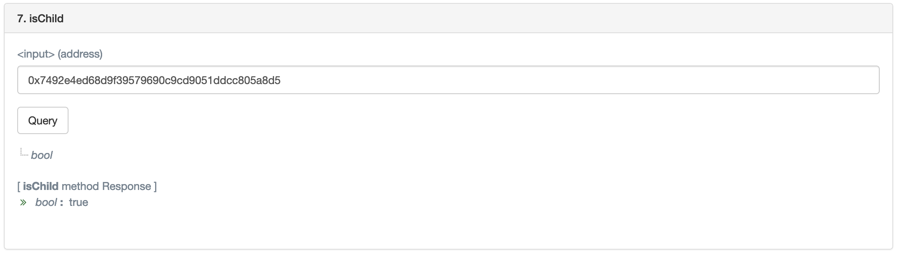
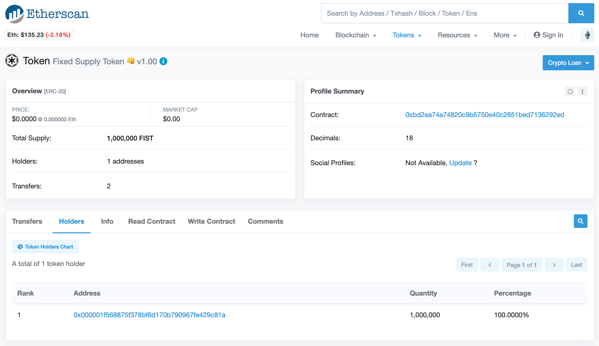

<kbd></kbd>

<br />

<hr />

# BokkyPooBah's Fixed Supply Token 👊 Factory

I have deployed many "vanilla" fixed supply token contracts in the past, on special request. This factory is a low fee vending machine to automate my fixed supply token contract deployment service.

This factory allows anyone to deploy an [ERC20](https://github.com/ethereum/EIPs/blob/master/EIPS/eip-20.md) token contract in a few minutes.

Call the factory `deployTokenContract(string symbol, string name, uint8 decimals, uint totalSupply)` function, sending `minimumFee` (or more) in ethers. The factory will deploy a token contract with the entire `totalSupply` assigned to the account executing the deployment transaction.

Use the standard ERC20 `transfer(...)`, `approve(...)` and `transferFrom(...)` functions to transfer these tokens to other accounts.

`minimumFee` is set to 0.1 ethers (ETH) currently. This amount can be viewed on the EtherScan page for the factory at [0xA550114ee3688601006b8b9f25e64732eF774934](https://etherscan.io/address/0xA550114ee3688601006b8b9f25e64732eF774934#readContract) (mainnet).

<br />

<hr />

## Table Of Contents

* [History](#history)
* [Bug Bounty Scope And Donations](#bug-bounty-scope-and-donations)
* [Questions And Answers](#questions-and-answers)
* [BokkyPooBah's Fixed Supply Token 👊 Factory](#bokkypoobahs-fixed-supply-token--factory)
  * [Factory Deployment Addresses](#factory-deployment-addresses)
  * [Factory deployTokenContract Only Application Binary Interface](#factory-deploytokencontract-only-application-binary-interface)
  * [Factory Full Application Binary Interface](#factory-full-application-binary-interface)
  * [Factory deployTokenContract Function](#factory-deploytokencontract-function)
* [Fixed Supply Token 👊](#fixed-supply-token-)
  * [Fixed Supply Token 👊 Application Binary Interface](#fixed-supply-token--application-binary-interface)
  * [Sample Fixed Supply Token 👊](#sample-fixed-supply-token-)
* [BokkyPooBah's Fixed Supply Token 👊 Factory Source Code](#bokkypoobahs-fixed-supply-token--factory-source-code)

<br />

<hr />

## History

Version | Date         | Notes
:------ |:------------ |:---------------------------------------
v1.00   | Mar 11 2019  | First version deployed to mainnet, and the Ropsten, Kovan, Rinkeby and Görli testnets
v1.10   | Mar 14 2019  | Second version deployed with:<br /> * [Incorrect comment on fee refund #1](https://github.com/bokkypoobah/FixedSupplyTokenFactory/issues/1)<br /> *  [Add warnings to `approveAndCall(...)` and `receiveApproval(...)` #2](https://github.com/bokkypoobah/FixedSupplyTokenFactory/issues/2)<br /> * [Cosmetics including `address payable` #3](https://github.com/bokkypoobah/FixedSupplyTokenFactory/issues/3)<br /> * [Remove deployment constructor arguments #4](https://github.com/bokkypoobah/FixedSupplyTokenFactory/issues/4),

<br />

<hr />

## Bug Bounty Scope And Donations

Details of the bug bounty program for this project can be found at [BokkyPooBah's Hall Of Fame And Bug Bounties](https://github.com/bokkypoobah/BokkyPooBahsHallOfFameAndBugBounties). Please consider [donating](https://github.com/bokkypoobah/BokkyPooBahsHallOfFameAndBugBounties#donations) to support the bug bounty, and the development and maintenance of decentralised applications.

The scope of the bug bounty for this project follows:

* [contracts/BokkyPooBahsFixedSupplyTokenFactory.sol](contracts/BokkyPooBahsFixedSupplyTokenFactory.sol)

<br />

Bounties awarded for this project:

* Mar 14 2019 - [Steve Marx](https://github.com/smarx/) - [Incorrect comment on fee refund #1](https://github.com/bokkypoobah/FixedSupplyTokenFactory/issues/1)
* Mar 14 2019 - [Alexey Pertsev](https://github.com/pertsev) - [Add warnings to `approveAndCall(...)` and `receiveApproval(...)` #2](https://github.com/bokkypoobah/FixedSupplyTokenFactory/issues/2) and [Cosmetics including `address payable` #3](https://github.com/bokkypoobah/FixedSupplyTokenFactory/issues/3)

<br />

<hr />

## Questions And Answers

### What is the cost of deploying my own token contract?

For the network transaction fees, deploying a new token contracts will cost [~ 900k gas](https://ropsten.etherscan.io/tx/0x7e70ff44232a52d30abcb5cb0b620c841e9b0ffc59044cf3d17be19f85169702). At a 5 gwei gas price, the network transaction fees will amount to ~ 0.0045 ethers (or ~ USD 0.61 at ETH/USD 136).

The is also a `minimumFee` (currently 0.1 ETH), that must be sent along with the factory's `deployTokenContract()` call. You can view the current `minimumFee` setting in the *Read Contract** tab of [EtherScan](https://etherscan.io/address/0xfAEcE565D445e98Ea024f02FF06607B4654eEb56#readContract), specified in wei.

<br />

### Why does this factory contract not use the EIP-1167 CloneFactory

[EIP 1167: Minimal Proxy Contract](https://eips.ethereum.org/EIPS/eip-1167) will result in cheaper gas cost for deployments (e.g. ~ 100k vs 900k). At this time, EtherScan has not implemented the use of the [ContractProbe contract](https://github.com/optionality/clone-factory#contractprobe-contract) to link a cloned contract to the template contract.

Additionally, each function execution using the CloneFactory will incur a slightly higher gas cost per transaction. From [DELEGATECALL forwarders: how to save ~50-98% on making many new contracts with the same code](https://www.reddit.com/r/ethereum/comments/6c1jui/delegatecall_forwarders_how_to_save_5098_on/):

> * Creating the forwarding contract only costs <50000 gas, regardless of the length of the underlying call
> * Each call to the contract thereafter will cost an additional ~1100 gas (700 DELEGATECALL + 400 memory expansion)

Using the CloneFactory will save on the upfront cost of deployment, but this should be compared to the additional long term expense of the ~1,100 gas per call.

<br />

### Why is there a fee required to deploy my own fixed supply token contract?

I have been asked multiple times to deploy fixed supply token contracts for other people and received donations in return. This factory is low fee vending machine to automate my fixed supply token contract deployment service.

<br />

### Why would I use this factory to deploy my fixed supply token?

#### Scrutinised smart contracts

The factory smart contracts deployed to the Ethereum mainnet at [0xA550114ee3688601006b8b9f25e64732eF774934](https://etherscan.io/address/0xA550114ee3688601006b8b9f25e64732eF774934#code) have an active bug bounty program to encourage other developers and researchers to scrutinise these smart contracts. Any FixedSupplyToken smart contracts deployed through the factory will be relying on the same set of scrutinised smart contracts.

#### Convenience

This factory is just a convenient method of deploying vanilla fixed supply token contracts, and this deployment can be completed within 3 minutes.

Ethereum ERC20 supporting wallets can easily utilise this factory to deploy fixed supply token contracts on their user's request, straight from the wallet.

<br />

### Can I deploy my own fixed supply token contract without paying the fee?

Why not?

Note that the source code for FixedSupplyToken is optimised for easy source code validation and has the constructor operations moved into an `init(...)` function that has to be run once only, immediately after the token contract has been deployed. These two operations are automatically executed when deploying through the factory.

It is simpler to deploy a fixed supply token contract like [https://github.com/bokkypoobah/Tokens/blob/master/contracts/FixedSupplyToken.sol](https://github.com/bokkypoobah/Tokens/blob/master/contracts/FixedSupplyToken.sol) yourself, if you want to avoid this Factory's `minimumFee`. You will however have to check, deploy and verify the source code yourself.

<br />

### How ERC20 compliant are the deployed FixedSupplyToken contract?

The FixedSupplyToken smart contract implements all the mandatory [ERC20](https://github.com/ethereum/EIPs/blob/master/EIPS/eip-20.md) `totalSupply()`, `balanceOf(...)`, `transfer(...)`, `transferFrom(...)`, `approve(...)` and `allowance(...)` functions.

This smart contract also implements the all the optional ERC20 `symbol()`, `name()` and `decimals()` functions.

Additionally, the `approveAndCall(...)` functionality is included so that the two operations of executing `tokenContract.approve(targetContract, tokens)` and `targetContract.doSomething(...)` (which will execute `tokenContract.transferFrom(user, targetContact, tokens)`) can be combined into a single `approveAndCall(...)` transaction. **Please only use this functionality with trusted smart contracts, and with checks!**

<br />

### How do I confirm that a token contract has been created by this factory?

Navigate to the **Read Contract** tab for the factory in EtherScan. e.g., Mainnet [0xA550114ee3688601006b8b9f25e64732eF774934](https://etherscan.io/address/0xA550114ee3688601006b8b9f25e64732eF774934#readContract). Enter the address of your token contract (e.g., `0x7492e4ed68d9f39579690c9cd9051ddcc805a8d5`) in the `isChild` input field and click on Query:

<kbd></kbd>

On the EtherScan token contract screen (e.g. [FIST110](https://etherscan.io/address/0x7492e4ed68d9f39579690c9cd9051ddcc805a8d5)) the **Contract Creator** will be the address of the factory contract `0xA550114ee3688601006b8b9f25e64732eF774934`.

<kbd></kbd>

<br />

<hr />

## BokkyPooBah's Fixed Supply Token 👊 Factory

### Factory Deployment Addresses

[contracts/BokkyPooBahsFixedSupplyTokenFactory.sol #a775958](https://github.com/bokkypoobah/FixedSupplyTokenFactory/blob/a775958f9eba9ef1579c40ef0c799b8e326780d2/contracts/BokkyPooBahsFixedSupplyTokenFactory.sol) has been deployed to the same address `0xA550114ee3688601006b8b9f25e64732eF774934` on the following networks:

* Mainnet [0xA550114ee3688601006b8b9f25e64732eF774934](https://etherscan.io/address/0xA550114ee3688601006b8b9f25e64732eF774934)
* Ropsten [0xA550114ee3688601006b8b9f25e64732eF774934](https://ropsten.etherscan.io/address/0xA550114ee3688601006b8b9f25e64732eF774934)
* Kovan [0xA550114ee3688601006b8b9f25e64732eF774934](https://kovan.etherscan.io/address/0xA550114ee3688601006b8b9f25e64732eF774934)
* Rinkeby [0xA550114ee3688601006b8b9f25e64732eF774934](https://rinkeby.etherscan.io/address/0xA550114ee3688601006b8b9f25e64732eF774934)
* Görli [0xA550114ee3688601006b8b9f25e64732eF774934](https://goerli.etherscan.io/address/0xA550114ee3688601006b8b9f25e64732eF774934)

<br />

### Factory deployTokenContract Only Application Binary Interface

Only for the `deployTokenContract(...)` function:

```javascript
[{"constant":false,"inputs":[{"name":"symbol","type":"string"},{"name":"name","type":"string"},{"name":"decimals","type":"uint8"},{"name":"totalSupply","type":"uint256"}],"name":"deployTokenContract","outputs":[{"name":"token","type":"address"}],"payable":true,"stateMutability":"payable","type":"function"}]
```

<br />

### Factory Full Application Binary Interface

```javascript
[{"constant":false,"inputs":[{"name":"token","type":"address"},{"name":"tokens","type":"uint256"}],"name":"recoverTokens","outputs":[],"payable":false,"stateMutability":"nonpayable","type":"function"},{"constant":false,"inputs":[{"name":"_minimumFee","type":"uint256"}],"name":"setMinimumFee","outputs":[],"payable":false,"stateMutability":"nonpayable","type":"function"},{"constant":true,"inputs":[],"name":"minimumFee","outputs":[{"name":"","type":"uint256"}],"payable":false,"stateMutability":"view","type":"function"},{"constant":true,"inputs":[],"name":"numberOfChildren","outputs":[{"name":"","type":"uint256"}],"payable":false,"stateMutability":"view","type":"function"},{"constant":true,"inputs":[{"name":"","type":"uint256"}],"name":"children","outputs":[{"name":"","type":"address"}],"payable":false,"stateMutability":"view","type":"function"},{"constant":false,"inputs":[],"name":"acceptOwnership","outputs":[],"payable":false,"stateMutability":"nonpayable","type":"function"},{"constant":true,"inputs":[],"name":"owner","outputs":[{"name":"","type":"address"}],"payable":false,"stateMutability":"view","type":"function"},{"constant":true,"inputs":[],"name":"newAddress","outputs":[{"name":"","type":"address"}],"payable":false,"stateMutability":"view","type":"function"},{"constant":false,"inputs":[{"name":"symbol","type":"string"},{"name":"name","type":"string"},{"name":"decimals","type":"uint8"},{"name":"totalSupply","type":"uint256"}],"name":"deployTokenContract","outputs":[{"name":"token","type":"address"}],"payable":true,"stateMutability":"payable","type":"function"},{"constant":true,"inputs":[],"name":"newOwner","outputs":[{"name":"","type":"address"}],"payable":false,"stateMutability":"view","type":"function"},{"constant":false,"inputs":[{"name":"_newAddress","type":"address"}],"name":"deprecateFactory","outputs":[],"payable":false,"stateMutability":"nonpayable","type":"function"},{"constant":false,"inputs":[{"name":"_newOwner","type":"address"}],"name":"transferOwnership","outputs":[],"payable":false,"stateMutability":"nonpayable","type":"function"},{"constant":true,"inputs":[{"name":"","type":"address"}],"name":"isChild","outputs":[{"name":"","type":"bool"}],"payable":false,"stateMutability":"view","type":"function"},{"inputs":[],"payable":false,"stateMutability":"nonpayable","type":"constructor"},{"payable":true,"stateMutability":"payable","type":"fallback"},{"anonymous":false,"inputs":[{"indexed":false,"name":"_newAddress","type":"address"}],"name":"FactoryDeprecated","type":"event"},{"anonymous":false,"inputs":[{"indexed":false,"name":"oldFee","type":"uint256"},{"indexed":false,"name":"newFee","type":"uint256"}],"name":"MinimumFeeUpdated","type":"event"},{"anonymous":false,"inputs":[{"indexed":true,"name":"owner","type":"address"},{"indexed":true,"name":"token","type":"address"},{"indexed":false,"name":"symbol","type":"string"},{"indexed":false,"name":"name","type":"string"},{"indexed":false,"name":"decimals","type":"uint8"},{"indexed":false,"name":"totalSupply","type":"uint256"}],"name":"TokenDeployed","type":"event"},{"anonymous":false,"inputs":[{"indexed":true,"name":"_from","type":"address"},{"indexed":true,"name":"_to","type":"address"}],"name":"OwnershipTransferred","type":"event"}]
```

<br />

### Factory deployTokenContract Function

```javascript
function deployTokenContract(string memory symbol, string memory name, uint8 decimals, uint totalSupply) public payable returns (address token);
```

Deploy a new token contract. The account executing this function will be assigned as the owner of the new token contract. The entire `totalSupply` is minted for the token contract owner.

A fee in ethers may also be payable for the successful execution of this function. See [minimumFee](#minimumFee).

#### Parameters

* `string symbol` - Symbol, e.g., 'MYT'
* `string name` - Token contract name, e.g., 'My Token Contract'
* `uint decimals` - Decimal places, between 0 and 27. Commonly 18
* `uint totalSupply` - The number of tokens that will be minted to the token contract owner's account

#### Returns

* `address` - Address of the new token contract

#### Events

The following event is emitted on successful deployment of the new token contract

```javascript
event TokenDeployed(address indexed owner, address indexed token, string symbol, string name, uint8 decimals, uint totalSupply);
```

#### Example

```javascript
address newTokenContract = factory.deployTokenContract("FIST110", "Fixed Supply Token 👊 v1.10", 18, "1000000000000000000000000");
```

Deploys a new token contract with 1,000,000.000000000000000000 FIST110 tokens minted to the transaction sending account.

<br />

<hr />

## Fixed Supply Token 👊

This factory will deploy fixed supply token token contract that implement the [ERC20](https://github.com/ethereum/EIPs/blob/master/EIPS/eip-20.md) token standard interface. The ERC20 optional `symbol()`, `name()` and `decimals()` have been implemented in this token contract.

Additionally, the `approveAndCall(...)` functionality is included so that the two operations of executing `tokenContract.approve(targetContract, tokens)` and `targetContract.doSomething(...)` (which will execute `tokenContract.transferFrom(user, targetContact, tokens)`) can be combined into a single `approveAndCall(...)` transaction. Please only use this functionality with trusted smart contracts!

<br />

## Fixed Supply Token 👊 Application Binary Interface

```javascript
[{"constant":false,"inputs":[{"name":"token","type":"address"},{"name":"tokens","type":"uint256"}],"name":"recoverTokens","outputs":[],"payable":false,"stateMutability":"nonpayable","type":"function"},{"constant":true,"inputs":[],"name":"name","outputs":[{"name":"","type":"string"}],"payable":false,"stateMutability":"view","type":"function"},{"constant":false,"inputs":[{"name":"spender","type":"address"},{"name":"tokens","type":"uint256"}],"name":"approve","outputs":[{"name":"success","type":"bool"}],"payable":false,"stateMutability":"nonpayable","type":"function"},{"constant":true,"inputs":[],"name":"totalSupply","outputs":[{"name":"","type":"uint256"}],"payable":false,"stateMutability":"view","type":"function"},{"constant":false,"inputs":[{"name":"_owner","type":"address"}],"name":"init","outputs":[],"payable":false,"stateMutability":"nonpayable","type":"function"},{"constant":false,"inputs":[{"name":"from","type":"address"},{"name":"to","type":"address"},{"name":"tokens","type":"uint256"}],"name":"transferFrom","outputs":[{"name":"success","type":"bool"}],"payable":false,"stateMutability":"nonpayable","type":"function"},{"constant":true,"inputs":[],"name":"decimals","outputs":[{"name":"","type":"uint8"}],"payable":false,"stateMutability":"view","type":"function"},{"constant":true,"inputs":[{"name":"tokenOwner","type":"address"}],"name":"balanceOf","outputs":[{"name":"balance","type":"uint256"}],"payable":false,"stateMutability":"view","type":"function"},{"constant":false,"inputs":[],"name":"acceptOwnership","outputs":[],"payable":false,"stateMutability":"nonpayable","type":"function"},{"constant":true,"inputs":[],"name":"owner","outputs":[{"name":"","type":"address"}],"payable":false,"stateMutability":"view","type":"function"},{"constant":true,"inputs":[],"name":"symbol","outputs":[{"name":"","type":"string"}],"payable":false,"stateMutability":"view","type":"function"},{"constant":false,"inputs":[{"name":"tokenOwner","type":"address"},{"name":"symbol","type":"string"},{"name":"name","type":"string"},{"name":"decimals","type":"uint8"},{"name":"fixedSupply","type":"uint256"}],"name":"init","outputs":[],"payable":false,"stateMutability":"nonpayable","type":"function"},{"constant":false,"inputs":[{"name":"to","type":"address"},{"name":"tokens","type":"uint256"}],"name":"transfer","outputs":[{"name":"success","type":"bool"}],"payable":false,"stateMutability":"nonpayable","type":"function"},{"constant":false,"inputs":[{"name":"spender","type":"address"},{"name":"tokens","type":"uint256"},{"name":"data","type":"bytes"}],"name":"approveAndCall","outputs":[{"name":"success","type":"bool"}],"payable":false,"stateMutability":"nonpayable","type":"function"},{"constant":true,"inputs":[],"name":"newOwner","outputs":[{"name":"","type":"address"}],"payable":false,"stateMutability":"view","type":"function"},{"constant":true,"inputs":[{"name":"tokenOwner","type":"address"},{"name":"spender","type":"address"}],"name":"allowance","outputs":[{"name":"remaining","type":"uint256"}],"payable":false,"stateMutability":"view","type":"function"},{"constant":false,"inputs":[{"name":"_newOwner","type":"address"}],"name":"transferOwnership","outputs":[],"payable":false,"stateMutability":"nonpayable","type":"function"},{"payable":true,"stateMutability":"payable","type":"fallback"},{"anonymous":false,"inputs":[{"indexed":true,"name":"_from","type":"address"},{"indexed":true,"name":"_to","type":"address"}],"name":"OwnershipTransferred","type":"event"},{"anonymous":false,"inputs":[{"indexed":true,"name":"from","type":"address"},{"indexed":true,"name":"to","type":"address"},{"indexed":false,"name":"tokens","type":"uint256"}],"name":"Transfer","type":"event"},{"anonymous":false,"inputs":[{"indexed":true,"name":"tokenOwner","type":"address"},{"indexed":true,"name":"spender","type":"address"},{"indexed":false,"name":"tokens","type":"uint256"}],"name":"Approval","type":"event"}]
```

<br />

### Sample Fixed Supply Token 👊

Following is the screenshot of a newly deployed [Fixed Supply Token 👊 v1.10](https://etherscan.io/token/0x7492e4ed68d9f39579690c9cd9051ddcc805a8d5#balances):

<kbd></kbd>

<br />

<hr />

### BokkyPooBah's Fixed Supply Token 👊 Factory Source Code

From [contracts/BokkyPooBahsFixedSupplyTokenFactory.sol #a775958](https://github.com/bokkypoobah/FixedSupplyTokenFactory/blob/a775958f9eba9ef1579c40ef0c799b8e326780d2/contracts/BokkyPooBahsFixedSupplyTokenFactory.sol):

```javascript
pragma solidity ^0.5.4;

// ----------------------------------------------------------------------------
// BokkyPooBah's Fixed Supply Token 👊 + Factory v1.10
//
// A factory to conveniently deploy your own source code verified fixed supply
// token contracts
//
// Factory deployment address: 0xA550114ee3688601006b8b9f25e64732eF774934
//
// https://github.com/bokkypoobah/FixedSupplyTokenFactory
//
// Enjoy. (c) BokkyPooBah / Bok Consulting Pty Ltd 2019. The MIT Licence.
// ----------------------------------------------------------------------------


// ----------------------------------------------------------------------------
// Safe maths
// ----------------------------------------------------------------------------
library SafeMath {
    function add(uint a, uint b) internal pure returns (uint c) {
        c = a + b;
        require(c >= a);
    }
    function sub(uint a, uint b) internal pure returns (uint c) {
        require(b <= a);
        c = a - b;
    }
}


// ----------------------------------------------------------------------------
// Owned contract, with token recovery
// ----------------------------------------------------------------------------
contract Owned {
    address payable public owner;
    address public newOwner;

    event OwnershipTransferred(address indexed _from, address indexed _to);

    modifier onlyOwner {
        require(msg.sender == owner);
        _;
    }

    function init(address _owner) public {
        require(owner == address(0));
        owner = address(uint160(_owner));
    }
    function transferOwnership(address _newOwner) public onlyOwner {
        newOwner = _newOwner;
    }
    function acceptOwnership() public {
        require(msg.sender == newOwner);
        emit OwnershipTransferred(owner, newOwner);
        owner = address(uint160(newOwner));
        newOwner = address(0);
    }
    function recoverTokens(address token, uint tokens) public onlyOwner {
        if (token == address(0)) {
            owner.transfer((tokens == 0 ? address(this).balance : tokens));
        } else {
            ERC20Interface(token).transfer(owner, tokens == 0 ? ERC20Interface(token).balanceOf(address(this)) : tokens);
        }
    }
}


// ----------------------------------------------------------------------------
// ApproveAndCall Fallback
// NOTE for contracts implementing this interface:
// 1. An error must be thrown if there are errors executing `transferFrom(...)`
// 2. The calling token contract must be checked to prevent malicious behaviour
// ----------------------------------------------------------------------------
contract ApproveAndCallFallback {
    function receiveApproval(address from, uint256 tokens, address token, bytes memory data) public;
}


// ----------------------------------------------------------------------------
// ERC Token Standard #20 Interface
// https://github.com/ethereum/EIPs/blob/master/EIPS/eip-20-token-standard.md
// ----------------------------------------------------------------------------
contract ERC20Interface {
    event Transfer(address indexed from, address indexed to, uint tokens);
    event Approval(address indexed tokenOwner, address indexed spender, uint tokens);

    function totalSupply() public view returns (uint);
    function balanceOf(address tokenOwner) public view returns (uint balance);
    function allowance(address tokenOwner, address spender) public view returns (uint remaining);
    function transfer(address to, uint tokens) public returns (bool success);
    function approve(address spender, uint tokens) public returns (bool success);
    function transferFrom(address from, address to, uint tokens) public returns (bool success);
}


// ----------------------------------------------------------------------------
// Token Interface = ERC20 + symbol + name + decimals + approveAndCall
// ----------------------------------------------------------------------------
contract TokenInterface is ERC20Interface {
    function symbol() public view returns (string memory);
    function name() public view returns (string memory);
    function decimals() public view returns (uint8);
    function approveAndCall(address spender, uint tokens, bytes memory data) public returns (bool success);
}


// ----------------------------------------------------------------------------
// FixedSupplyToken 👊 = ERC20 + symbol + name + decimals + approveAndCall
// ----------------------------------------------------------------------------
contract FixedSupplyToken is TokenInterface, Owned {
    using SafeMath for uint;

    string _symbol;
    string  _name;
    uint8 _decimals;
    uint _totalSupply;

    mapping(address => uint) balances;
    mapping(address => mapping(address => uint)) allowed;

    function init(address tokenOwner, string memory symbol, string memory name, uint8 decimals, uint fixedSupply) public {
        super.init(tokenOwner);
        _symbol = symbol;
        _name = name;
        _decimals = decimals;
        _totalSupply = fixedSupply;
        balances[tokenOwner] = _totalSupply;
        emit Transfer(address(0), tokenOwner, _totalSupply);
    }
    function symbol() public view returns (string memory) {
        return _symbol;
    }
    function name() public view returns (string memory) {
        return _name;
    }
    function decimals() public view returns (uint8) {
        return _decimals;
    }
    function totalSupply() public view returns (uint) {
        return _totalSupply.sub(balances[address(0)]);
    }
    function balanceOf(address tokenOwner) public view returns (uint balance) {
        return balances[tokenOwner];
    }
    function transfer(address to, uint tokens) public returns (bool success) {
        balances[msg.sender] = balances[msg.sender].sub(tokens);
        balances[to] = balances[to].add(tokens);
        emit Transfer(msg.sender, to, tokens);
        return true;
    }
    function approve(address spender, uint tokens) public returns (bool success) {
        allowed[msg.sender][spender] = tokens;
        emit Approval(msg.sender, spender, tokens);
        return true;
    }
    function transferFrom(address from, address to, uint tokens) public returns (bool success) {
        balances[from] = balances[from].sub(tokens);
        allowed[from][msg.sender] = allowed[from][msg.sender].sub(tokens);
        balances[to] = balances[to].add(tokens);
        emit Transfer(from, to, tokens);
        return true;
    }
    function allowance(address tokenOwner, address spender) public view returns (uint remaining) {
        return allowed[tokenOwner][spender];
    }
    // NOTE Only use this call with a trusted spender contract
    function approveAndCall(address spender, uint tokens, bytes memory data) public returns (bool success) {
        allowed[msg.sender][spender] = tokens;
        emit Approval(msg.sender, spender, tokens);
        ApproveAndCallFallback(spender).receiveApproval(msg.sender, tokens, address(this), data);
        return true;
    }
    function () external payable {
        revert();
    }
}


// ----------------------------------------------------------------------------
// BokkyPooBah's Fixed Supply Token 👊 Factory
//
// Notes:
//   * The `newContractAddress` deprecation is just advisory
//   * A fee equal to or above `minimumFee` must be sent with the
//   `deployTokenContract(...)` call
//
// Execute `deployTokenContract(...)` with the following parameters to deploy
// your very own FixedSupplyToken contract:
//   symbol         symbol
//   name           name
//   decimals       number of decimal places for the token contract
//   totalSupply    the fixed token total supply
//
// For example, deploying a FixedSupplyToken contract with a `totalSupply`
// of 1,000.000000000000000000 tokens:
//   symbol         "ME"
//   name           "My Token"
//   decimals       18
//   initialSupply  10000000000000000000000 = 1,000.000000000000000000 tokens
//
// The TokenDeployed() event is logged with the following parameters:
//   owner          the account that execute this transaction
//   token          the newly deployed FixedSupplyToken address
//   symbol         symbol
//   name           name
//   decimals       number of decimal places for the token contract
//   totalSupply    the fixed token total supply
// ----------------------------------------------------------------------------
contract BokkyPooBahsFixedSupplyTokenFactory is Owned {
    using SafeMath for uint;

    address public newAddress;
    uint public minimumFee = 0.1 ether;
    mapping(address => bool) public isChild;
    address[] public children;

    event FactoryDeprecated(address _newAddress);
    event MinimumFeeUpdated(uint oldFee, uint newFee);
    event TokenDeployed(address indexed owner, address indexed token, string symbol, string name, uint8 decimals, uint totalSupply);

    constructor () public {
        super.init(msg.sender);
    }
    function numberOfChildren() public view returns (uint) {
        return children.length;
    }
    function deprecateFactory(address _newAddress) public onlyOwner {
        require(newAddress == address(0));
        emit FactoryDeprecated(_newAddress);
        newAddress = _newAddress;
    }
    function setMinimumFee(uint _minimumFee) public onlyOwner {
        emit MinimumFeeUpdated(minimumFee, _minimumFee);
        minimumFee = _minimumFee;
    }
    function deployTokenContract(string memory symbol, string memory name, uint8 decimals, uint totalSupply) public payable returns (FixedSupplyToken token) {
        require(msg.value >= minimumFee);
        require(decimals <= 27);
        require(totalSupply > 0);
        token = new FixedSupplyToken();
        token.init(msg.sender, symbol, name, decimals, totalSupply);
        isChild[address(token)] = true;
        children.push(address(token));
        emit TokenDeployed(owner, address(token), symbol, name, decimals, totalSupply);
        if (msg.value > 0) {
            owner.transfer(msg.value);
        }
    }
    function () external payable {
        revert();
    }
}
```

<br />

<br />

Enjoy!

(c) BokkyPooBah / Bok Consulting Pty Ltd - Mar 14 2019. The MIT Licence.
