<kbd>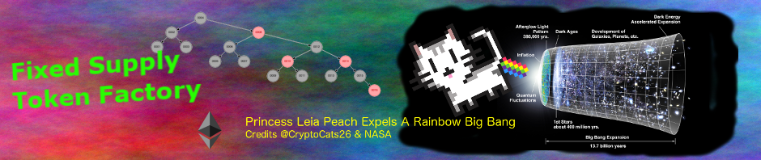</kbd>


<br />

<hr />

# BokkyPooBah's Fixed Supply Token 👊 Factory - User's Guide

Or how to deploy your own FixedSupplyToken token contract in less than 3 minutes.

This guide will assume that you already have MetaMask installed in your browser, and you have some ethers (ETH) in your MetaMask account on your desired network. We will use MyCrypto to interact with the factory smart contract, and use MetaMask as the signing wallet.

<br />

<hr />

# Testnet Ether Faucets

The Ropsten, Kovan, Rinkeby and Görli testnets have faucets where you can request for some testnet ETH.

To deploy your own token contract, you will need sufficient ethers to pay for factory `minimumFee` (currently set to 0.1 ethers) and the Ethereum network transaction fees.

Experiment in the testnets before deploying your own token contracts on the Ethereum mainnet.

<br />

Testnet   | Explorers                     | Testnet ETH Faucets
:-------- |:----------------------------- |:-------------------------
Ropsten   | https://ropsten.etherscan.io/ | https://faucet.metamask.io/<br />https://twitter.com/BokkyPooBah/status/1099498823699714048
Kovan     | https://kovan.etherscan.io/   | https://faucet.kovan.network/<br />https://github.com/kovan-testnet/faucet<br />https://faucet.kovan.radarrelay.com/
Rinkeby   | https://rinkeby.etherscan.io/ | https://faucet.rinkeby.io/<br />https://faucet.metamask.io/
Görli     | https://goerli.etherscan.io/  | https://faucet.goerli.mudit.blog/<br />https://goerli-faucet.slock.it/<br />https://bridge.goerli.com/

<br />

<hr />

## Factory Contract Details

The factory contracts have been deployed to the same address `0xA550114ee3688601006b8b9f25e64732eF774934` on the following networks:

* Mainnet [0xA550114ee3688601006b8b9f25e64732eF774934](https://etherscan.io/address/0xA550114ee3688601006b8b9f25e64732eF774934)
* Ropsten [0xA550114ee3688601006b8b9f25e64732eF774934](https://ropsten.etherscan.io/address/0xA550114ee3688601006b8b9f25e64732eF774934)
* Kovan [0xA550114ee3688601006b8b9f25e64732eF774934](https://kovan.etherscan.io/address/0xA550114ee3688601006b8b9f25e64732eF774934)
* Rinkeby [0xA550114ee3688601006b8b9f25e64732eF774934](https://rinkeby.etherscan.io/address/0xA550114ee3688601006b8b9f25e64732eF774934)
* Görli [0xA550114ee3688601006b8b9f25e64732eF774934](https://goerli.etherscan.io/address/0xA550114ee3688601006b8b9f25e64732eF774934)

The function in the factory contract that deploys new token contracts:

```javascript
function deployTokenContract(string memory symbol, string memory name, uint8 decimals, uint totalSupply) public payable returns (address token);
```

The account executing this function will be assigned as the owner of the new token contract. The entire `totalSupply` is minted for the token contract owner.

A fee in ethers (`minimumFee`, currently 0.1 ETH) is also be payable for the successful execution of this function.

#### Parameters

* `string symbol` - Symbol, e.g., 'MYT'
* `string name` - Token contract name, e.g., 'My Token Contract'
* `uint decimals` - Decimal places, between 0 and 27. Commonly 18
* `uint totalSupply` - The number of tokens that will be minted to the token contract owner's account

#### Returns

* `address` - Address of the new token contract

#### Events

The following event is emitted on successful deployment of the new token contract

```javascript
event TokenDeployed(address indexed owner, address indexed token, string symbol, string name, uint8 decimals, uint totalSupply);
```

The Application Binary Interface (ABI) for this factory's `deployTokenContract(...)` function follows:

> [{"constant":false,"inputs":[{"name":"symbol","type":"string"},{"name":"name","type":"string"},{"name":"decimals","type":"uint8"},{"name":"totalSupply","type":"uint256"}],"name":"deployTokenContract","outputs":[{"name":"token","type":"address"}],"payable":true,"stateMutability":"payable","type":"function"}]

<br />

<hr />

## Deploying a new token contract

For an example, we will deploy a token contract contract with the symbol `LEMON`, name `Lemonade 🍋 Stand`, 2 decimal places and a fixed totalSupply of 1000.00 tokens. This could represent the proportional share in the lemonade stand enterprise.

For this exercise, I will be using MyCrypto to interact with the factory contract, and MetaMask as the signing wallet. And I will be deploying my token contract on the Ropsten tesnet.

#### 1. Select your desired network in MetaMask

* Click on the MetaMask icon in your web browser tool bar
* Click on the selected network in the top to select a new network:
    <kbd>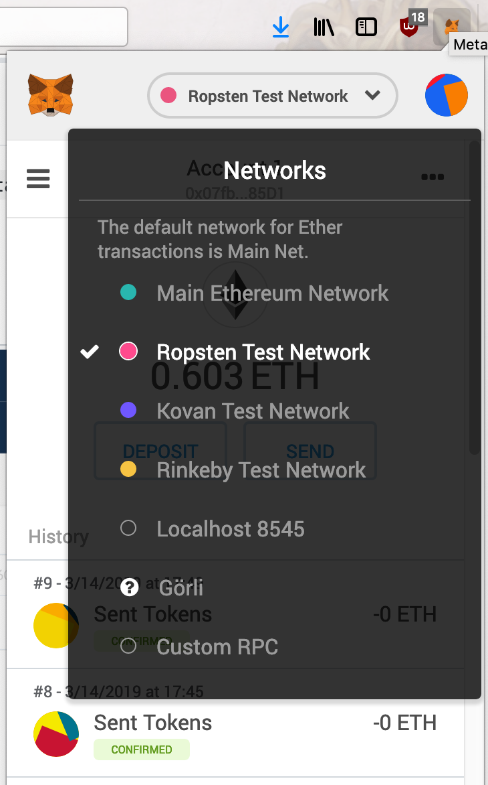</kbd>
    <br />

#### 2. Navigate to MyCrypto and select the right network

* Navigate to the contracts interaction page https://mycrypto.com/contracts/interact:
    <kbd>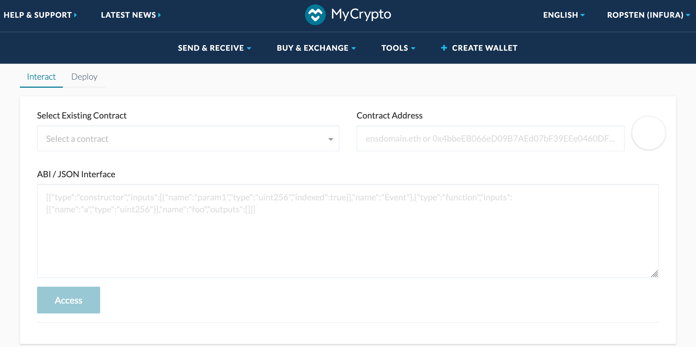</kbd>
    <br />
* Click the currently selected network on the top right if you want to select another network:
    <kbd>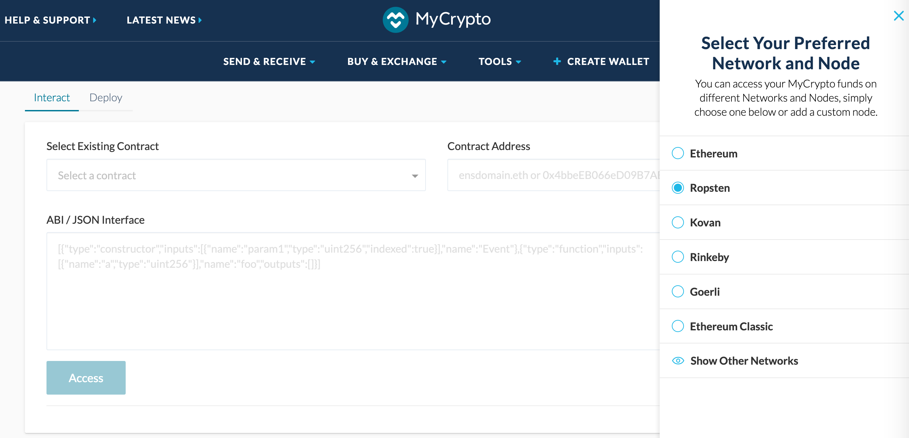</kbd>
    <br />

#### 3. Fill in the factory contract address and ABI

* Enter the factory contract address: `0xA550114ee3688601006b8b9f25e64732eF774934`
* Enter the `deployTokenContract(...)` ABI:
    > [{"constant":false,"inputs":[{"name":"symbol","type":"string"},{"name":"name","type":"string"},{"name":"decimals","type":"uint8"},{"name":"totalSupply","type":"uint256"}],"name":"deployTokenContract","outputs":[{"name":"token","type":"address"}],"payable":true,"stateMutability":"payable","type":"function"}]

* Click on Access
    <kbd>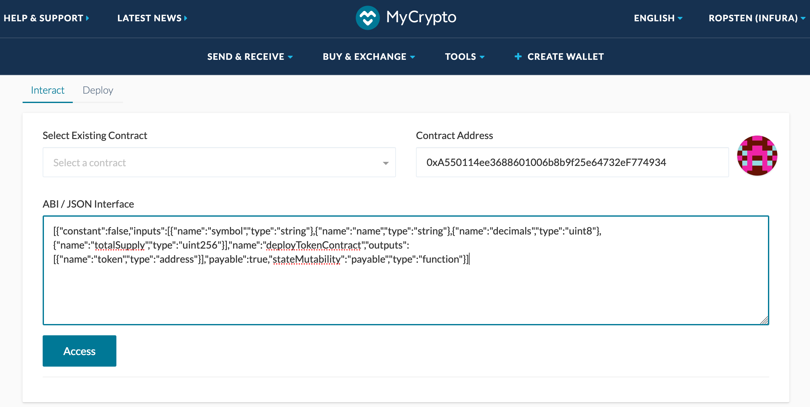</kbd>

#### 4. Fill in your token contract details

* symbol: `LEMON`
* name: `Lemonade 🍋 Stand`
* decimals: `2`
* totalSupply: 100000 (100000 units = 1,000.00 tokens with 2 decimal places)

<kbd>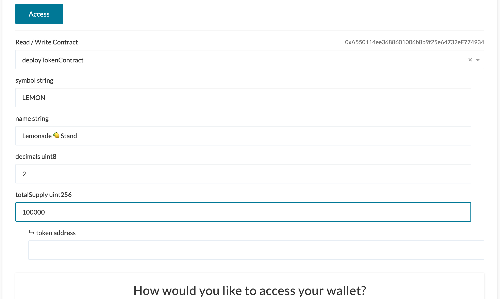</kbd>

#### 5. Access your wallet

In this example, I clicked on the MetaMask button:

<kbd>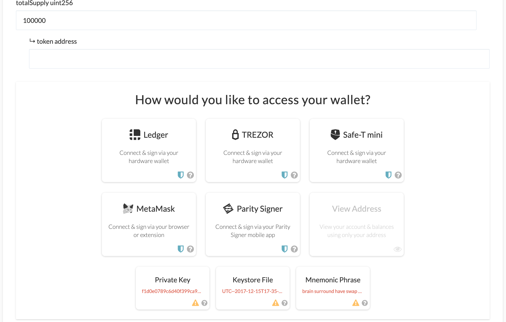</kbd>

#### 6. Wallet accessed

After the wallet is accessed, the MyCrypto screen changes to:

<kbd>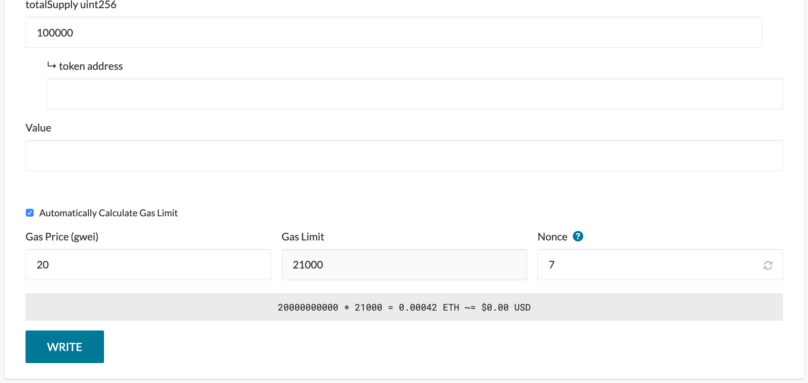</kbd>

#### 7. Fill in transaction details

* Value: Any amount greater than or equal `0.1` (the current `minimumFee`)
* Automatically Calculate Gas Limit: `off`
* Gas Price (gwei): `10` is OK for testnets. See [https://ethgasstation.info/](https://ethgasstation.info/) for the current Ethereum mainnet estimated gas prices
* Gas Limit: `1200000` (manually enter 200,000 without the commas)
* Click Write

<kbd>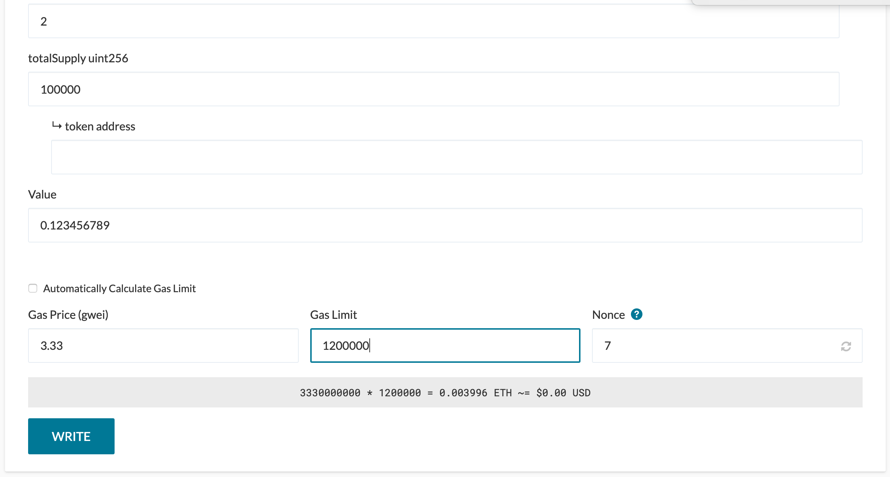</kbd>

#### 8. Generate and send the transaction

<kbd>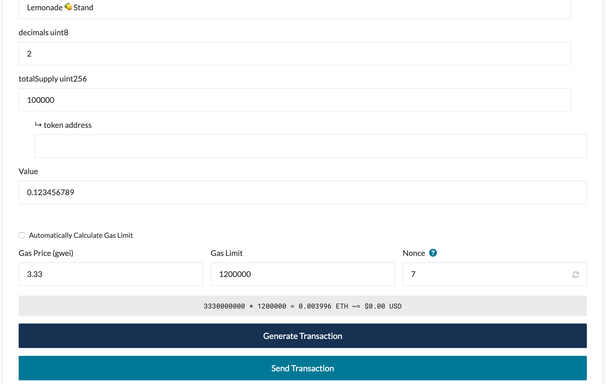</kbd>

#### 9. Confirm the transaction in MetaMask

<kbd>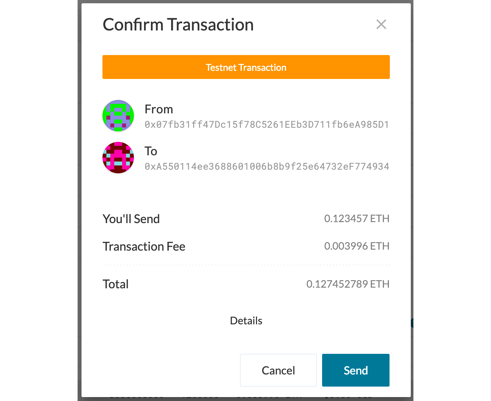</kbd>

<kbd>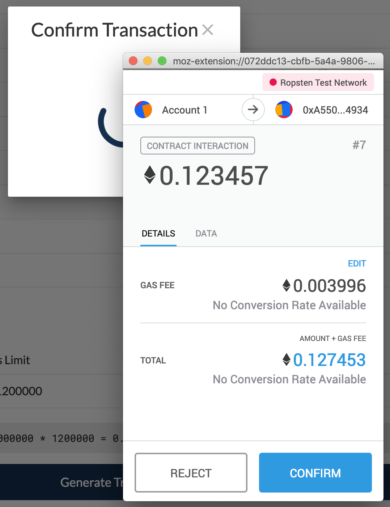</kbd>

#### 10. Transaction confirmed

* MyCrypto provides a link to the transaction in EtherScan at the bottom of the page:
    <kbd>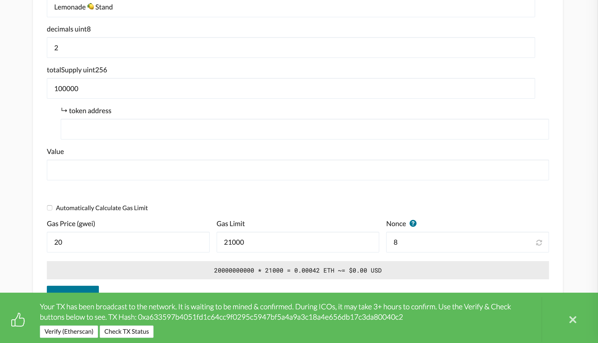</kbd>&nbsp;

* The transaction [0xa633597b4051fd1c64cc9f0295c5947bf5a4a9a3c18a4e656db17c3da80040c2](https://ropsten.etherscan.io/tx/0xa633597b4051fd1c64cc9f0295c5947bf5a4a9a3c18a4e656db17c3da80040c2) in EtherScan:
    <kbd>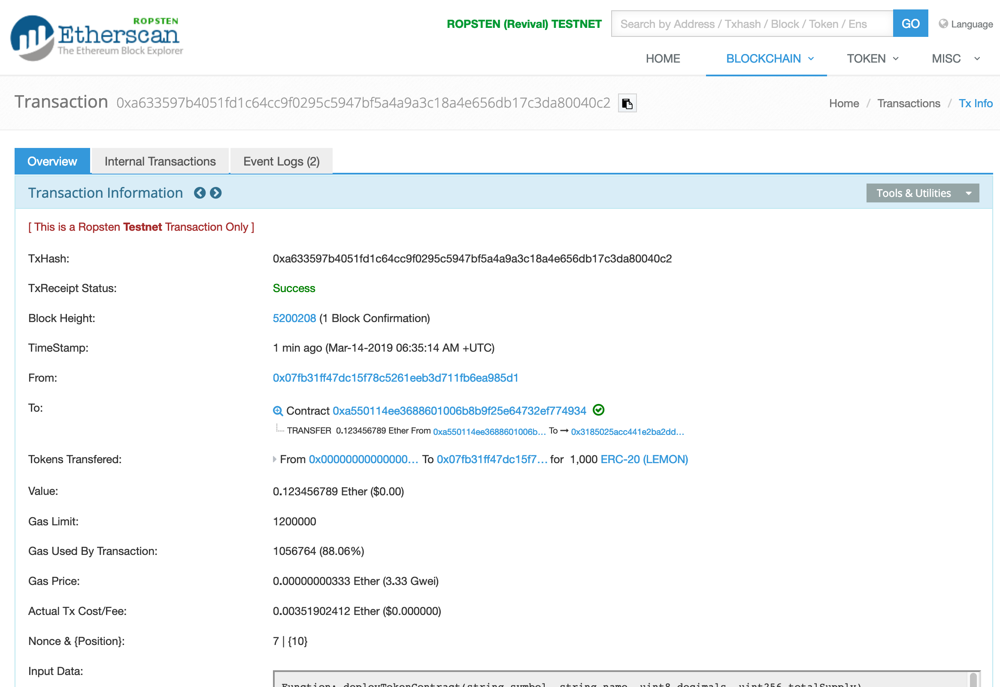</kbd>
* The transaction input data:
    <kbd>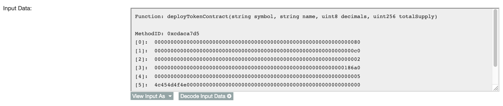</kbd>
* Click on the Decode Input Data to see the token contract deployment data:
    <kbd>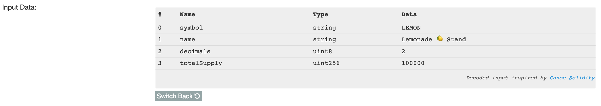</kbd>
* Click on the `ERC-20(LEMON)` link three screens above to see the [token contract transfers](https://ropsten.etherscan.io/token/0x9e458482b817e1238d04c374934f1306498b65b9):
    <kbd>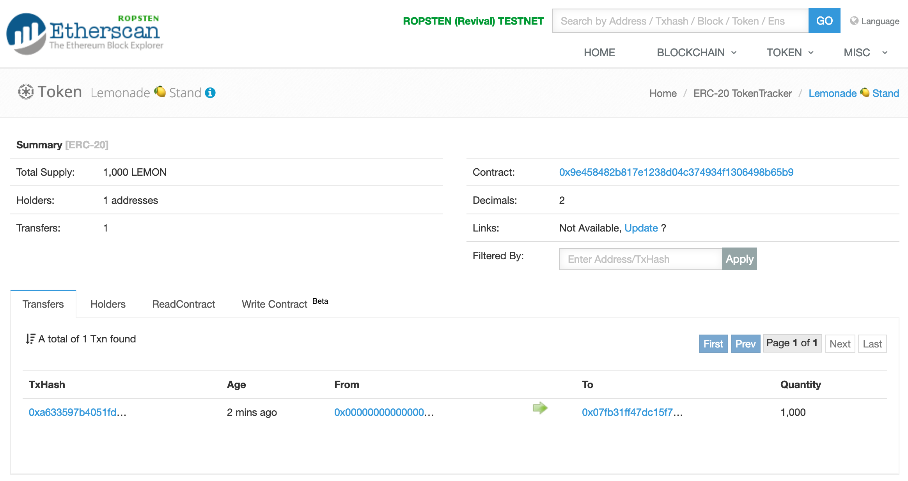</kbd>

<br />

<hr />

## Interacting with the newly deployed token contract

We will add the new token contract address to MetaMask so we can execute transfers of these tokens to other accounts.

### 1. Watch the new token contract in MetaMask

* Click on the MetaMask button in your browser tool bar
    <kbd>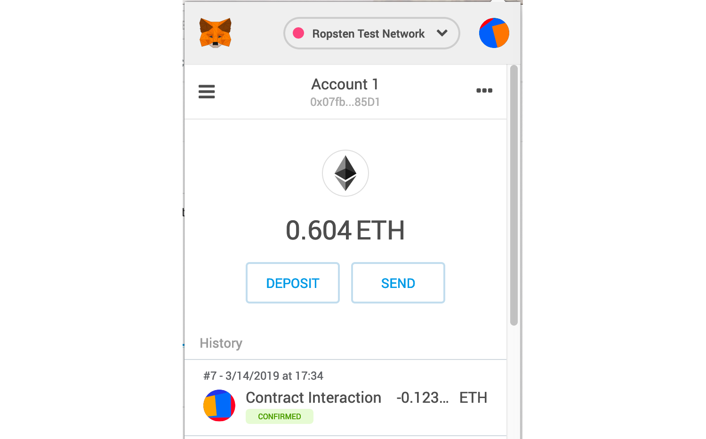</kbd>
* Click on the triple horizontal bar icon on the top left to show the tokens page
    <kbd>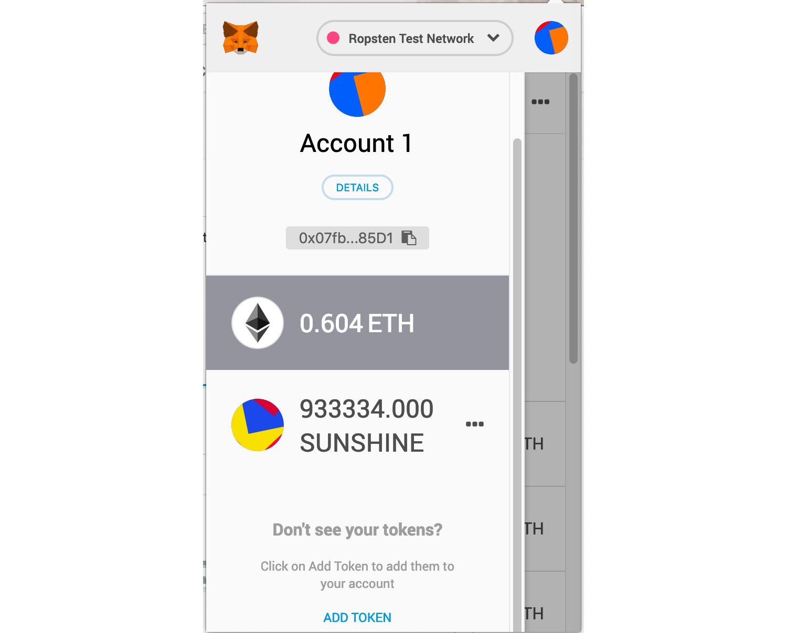</kbd>
* Click on the triple horizontal bar icon on the top left to show the tokens page
    <kbd></kbd>


<br />


https://ropsten.etherscan.io/find-similiar-contracts?a=0x9e458482b817e1238d04c374934f1306498b65b9&lvl=5

0x9E458482B817E1238D04c374934F1306498b65b9

Send to 0xa11ce05D4f2FEFF552EF5941A05740EE1fF69B21

https://ropsten.etherscan.io/tx/0xb0c98a005b34e6f8b52393f7b61af4b051f344a8e795f4faf379465b361d47ab

https://ropsten.etherscan.io/token/0x9e458482b817e1238d04c374934f1306498b65b9

https://ropsten.etherscan.io/token/0x9e458482b817e1238d04c374934f1306498b65b9

https://ropsten.etherscan.io/token/0x9e458482b817e1238d04c374934f1306498b65b9#balances


<br />

<br />

Enjoy!

(c) BokkyPooBah / Bok Consulting Pty Ltd - Mar 14 2019. The MIT Licence.
